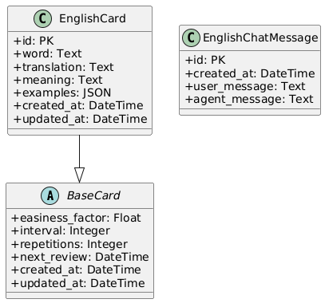

# Apêndices

Este documento contém informações complementares e materiais de suporte ao relatório técnico principal.

## Apêndice A — Guia de Instalação e Execução

### A.1 — Requisitos do Sistema

#### **Backend**
- Docker
- Docker Compose

#### **Frontend**
- Flutter 3.10+
- Android SDK (API 29+)
- Android Studio ou VS Code

### A.2 — Instalação do Backend

```bash
# Clonar repositório
git clone https://github.com/alexcyrillo/peixe-babel.git
cd peixe-babel/backend

# Configurar variáveis de ambiente
cp .env.example .env
# Editar .env com suas chaves de api da OpenAI

# Criação do container
docker compose up -d

# Criar ambiente virtual
python -m venv .venv
source .venv/bin/activate  # Linux/macOS
.\.venv\Scripts\Activate.ps1  # Windows

# Instalar dependências
pip install -r requirements.txt

# No console do container backend
docker compose exec backend python manage.py makemigrations flashcard 

# Executar migrações
docker compose exec backend python manage.py migrate

# Criar superusuário
docker compose exec backend python manage.py createsuperuser
```

### A.3 — Instalação do Frontend Mobile

```bash
cd peixe-babel/frontend

# Obter dependências
flutter pub get

# Editar host da API
# Em frontend > lib > services > api > api_provider.dart
# Altere o valor de apiBaseUrl para http://{HOST_DA_API}:8000/api/v1

# Executar em emulador/dispositivo
flutter run
```

## Apêndice B — Protocolo de Teste de Usabilidade

### B.1 — Roteiro de Tarefas

As tarefas a seguir orientam os participantes durante a avaliação de usabilidade do aplicativo móvel.

#### **Tarefa 1: Criar Flashcard**
1. Abra o aplicativo
2. Acesse o menu _Flashcards_
3. Acesse a opção _Criar Novo Flashcard_
4. Digite as palavras desejadas
5. Selecione _Criar flashcards_
6. Aguarde a criação do(s) Flashcard(s)

#### **Tarefa 2: Listar Flashcards Existentes**
1. Acesse o menu _Flashcards_
2. Acesse a opção _Ver Flashcards Existentes_

#### **Tarefa 3: Editar Flashcards**
1. Acesse o menu _Flashcards_
2. Acesse a opção _Ver Flashcards Existentes_
3. Selecione o Flashcard desejado
4. Edite os campos desejados
5. Selecione _Salvar Alterações_

#### **Tarefa 4: Revisar Flashcards**
1. Acesse o menu _Flashcards_
2. Acesse a opção _Iniciar Revisão_
3. Pense na tradução da palavra apresentada
4. Selecione _Responder_
5. Avalie a dificuldade percebida para lembrar da tradução

#### **Tarefa 5: Praticar Conversação**
1. Acesse o menu _Conversar com IA_
2. Digite a frase desejada
3. Selecione _Enviar_
4. Observe se a IA usa seu vocabulário

### B.2 — Questionário SUS (System Usability Scale)

Escala: 1 (Discordo totalmente) a 5 (Concordo totalmente)

   1. Eu acho que gostaria de usar este sistema frequentemente
   2. Eu achei o sistema desnecessariamente complexo
   3. Eu achei o sistema fácil de usar
   4. Eu acho que precisaria de ajuda técnica para usar este sistema
   5. Eu achei que as várias funções neste sistema estão bem integradas
   6. Eu achei que havia muita inconsistência neste sistema
   7. Eu imagino que a maioria das pessoas aprenderia a usar este sistema rapidamente
   8. Eu achei o sistema muito complicado de usar
   9. Eu me senti muito confiante usando o sistema
   10. Eu precisei aprender muitas coisas antes de conseguir usar este sistema

## Apêndice C — Configuração de APIs Externas

### C.1 — OpenAI API

O trecho a seguir ilustra a configuração do cliente da OpenAI utilizada para personalizar as respostas do assistente conforme o vocabulário do estudante.

```python
# backend/src/flashcard/services/chat_open_api.py
import os
from openai import OpenAI

from flashcard.services.vocabulary_getter import get_vocabulary

# Create client lazily to ensure environment is ready
API_KEY = os.environ.get("OPENAI_API_KEY")
DEFAULT_MODEL = os.environ.get("OPENAI_MODEL", "gpt-5-nano")

client = OpenAI(api_key=API_KEY)


def get_chat_response(prompt: str | None = None):
    if not API_KEY:
        raise RuntimeError("OPENAI_API_KEY não definida. Defina a variável de ambiente.")
 
    words = get_vocabulary()
    if isinstance(words, (list, tuple)):
        word_list = ", ".join(words)
    else:
        word_list = str(words)

    model = os.environ.get("OPENAI_MODEL", DEFAULT_MODEL)
    instructions = (
        f"Você é um robô que conversa em Inglês, que se adapta ao vocabulário do estudante. "
        f"O vocabulário que o seu aluno sabe é: {word_list}"
        f"Se não for possível responder apenas com o vocabulário do aluno, pode utilizar outras, porém disponibilize a tradução dessas novas palavras utilizadas"
    )
    user_input = prompt

    try:
        response = client.responses.create(
            model=model,
            instructions=instructions,
            input=user_input,
        )
    except Exception as exc:  
        raise RuntimeError(f"OpenAI request failed: {exc}") from exc

    text = getattr(response, "output_text", None)
    if text:
        return text

    output = getattr(response, "output", None)
    if output:
        parts: list[str] = []
        try:
            for item in output:
                content = item.get("content") if isinstance(item, dict) else None
                if not content and isinstance(item, list):
                    content = item
                if content:
                    for block in content:
                        if isinstance(block, dict):
                            text_val = block.get("text") or block.get("content")
                            if isinstance(text_val, str):
                                parts.append(text_val)
                            elif isinstance(text_val, list):
                                for sub in text_val:
                                    if isinstance(sub, dict) and "text" in sub:
                                        parts.append(sub.get("text"))
        except Exception:
            return str(response)
        return "\n".join([p for p in parts if p]) or str(response)

    return str(response)
```

## Apêndice D — Algoritmo SRS (SM-2)

### D.1 — Implementação de Review da Biblioteca SuperMemo2

O trecho a seguir reproduz a função `review` da biblioteca SuperMemo2, criada por _alankan886_ e disponível em https://github.com/alankan886/SuperMemo2/blob/main/supermemo2/sm_two.py. Ele serve como referência para a lógica original adotada neste trabalho.

```python
    def review(
        quality: int,
        easiness: float,
        interval: int,
        repetitions: int,
        review_datetime: Optional[Union[datetime, str]] = None,
    ) -> Dict:
        if not review_datetime:
            review_datetime = datetime.utcnow().isoformat(sep=" ", timespec="seconds")

        if isinstance(review_datetime, str):
            review_datetime = datetime.fromisoformat(review_datetime).replace(microsecond=0)

        if quality < 3:
            interval = 1
            repetitions = 0
        else:
            if repetitions == 0:
                interval = 1
            elif repetitions == 1:
                interval = 6
            else:
                interval = ceil(interval * easiness)

            repetitions += 1

        easiness += 0.1 - (5 - quality) * (0.08 + (5 - quality) * 0.02)
        if easiness < 1.3:
            easiness = 1.3

        review_datetime += timedelta(days=interval)

        return {
            "easiness": easiness,
            "interval": interval,
            "repetitions": repetitions,
            "review_datetime": str(review_datetime),
        }
```

### D.2 — Implementação da Biblioteca no Peixe Babel

O código abaixo mostra como a função `review` foi incorporada ao backend do Peixe Babel para calcular o próximo agendamento de revisão dos cartões de estudos.

```python
    # backend/services/srs_service.py
    from django.utils import timezone

    from rest_framework import mixins,viewsets, status
    from rest_framework.decorators import action
    from rest_framework.response import Response

    from supermemo2 import review

    from flashcard.models.english_card import EnglishCard
    from flashcard.serializers.english_card_serializers import EnglishCardSerializer
    from flashcard.serializers.review_serializer import ReviewSerializer


    class EnglishCardReviewViewSet(viewsets.GenericViewSet):
        queryset = EnglishCard.objects.all()
        serializer_class = ReviewSerializer

        def get_queryset(self):
            today = timezone.localdate()
            return EnglishCard.objects.filter(next_review__date__lte=today)

        def list(self, request):
            queryset = self.get_queryset()
            serializer = EnglishCardSerializer(queryset, many=True)
            return Response(serializer.data)

        def partial_update(self, request, pk=None):
            """
            Espera no body:
            {
                "score": int (dificuldade do card)
                "outro_campo": str
            }
            """
            instance = self.get_object()

            result = review(request.data.get('easiness_factor'), instance.easiness_factor, instance.interval, instance.repetitions, instance.next_review)

            instance.easiness_factor = result["easiness"]
            instance.interval = result["interval"]
            instance.repetitions = result["repetitions"]
            instance.next_review = result["review_datetime"]

            instance.save()

            serializer = self.get_serializer(instance, data=request.data, partial=True)
            serializer.is_valid(raise_exception=True)
            serializer.save()
            return Response(serializer.data, status=status.HTTP_200_OK)
```


## Apêndice E — Diagramas do Sistema

### E.1 — Diagrama ER (Entidade-Relacionamento)

A Figura E.1 apresenta as entidades principais relacionadas aos cartões de estudo e às mensagens de conversação utilizadas pelo Peixe Babel.

#### Figura E.1 — Diagrama de classes (cards e mensagens de chat)
<!-- Diagrama de classes adicional: cartas e mensagens de chat -->


<p class="footnote">Fonte: Elaborado pelo autor (2025).</p>

### E.2 — Diagrama de Contexto

A Figura E.2 ilustra o diagrama de contexto do sistema.

#### Figura E.2 — Diagrama de Contexto


<p class="footnote">Fonte: Elaborado pelo autor (2025).</p>

### E.3 — Diagrama de Casos de Uso

A Figura E.3 apresenta os casos de uso do sistema.

#### Figura E.3 — Diagrama de Casos de Uso


<p class="footnote">Fonte: Elaborado pelo autor (2025).</p>

### E.4 — Diagrama de Classes

A Figura E.4 detalha o diagrama de classes do sistema.

#### Figura E.4 — Diagrama de Classes


<p class="footnote">Fonte: Elaborado pelo autor (2025).</p>

### E.5 — Diagramas de Sequência

As Figuras E.5.a, E.5.b e E.5.c apresentam os diagramas de sequência para os principais fluxos.

#### Figura E.5.a — Sequência: Criação de Flashcard


<p class="footnote">Fonte: Elaborado pelo autor (2025).</p>

#### Figura E.5.b — Sequência: Revisão de Flashcard


<p class="footnote">Fonte: Elaborado pelo autor (2025).</p>

#### Figura E.5.c — Sequência: Conversação com IA


<p class="footnote">Fonte: Elaborado pelo autor (2025).</p>

### E.6 — Diagrama de Estado

A Figura E.6 mostra o diagrama de estados do flashcard.

#### Figura E.6 — Diagrama de Estados


<p class="footnote">Fonte: Elaborado pelo autor (2025).</p>

### E.7 — Diagrama de Componentes

A Figura E.7 apresenta o diagrama de componentes.

#### Figura E.7 — Diagrama de Componentes


<p class="footnote">Fonte: Elaborado pelo autor (2025).</p>

## Apêndice F — Cronograma Detalhado

A Tabela F.1 detalha o cronograma de execução do projeto, dividido em semanas, com as respectivas atividades e entregáveis previstos.

**Tabela F.1 — Cronograma Detalhado**

| Semana | Atividade | Entregável |
|--------|-----------|------------|
| 1-2 | Levantamento de requisitos | Documento de Visão v1.0 |
| 3-4 | Prototipagem UX | Wireframes e mockups |
| 5-6 | Setup infraestrutura | Backend base + DB |
| 7-8 | Implementação CRUD flashcards | API endpoints + testes |
| 9-10 | Integração APIs externas | Enriquecimento automático |
| 11-12 | Implementação SRS | Algoritmo + testes |
| 13-14 | Módulo de conversação IA | Integração LLM |
| 15-16 | App mobile (Flutter) | Telas principais |
| 17 | Testes de usabilidade | Relatório SUS |
| 18 | Experimento de retenção | Dados coletados |
| 19 | Análise de resultados | Gráficos e tabelas |
| 20 | Documentação final | TCC completo |

<p class="footnote">Fonte: Elaborado pelo autor (2025).</p>

## Apêndice G — Licenças de Software Utilizado

A Tabela G.1 lista as bibliotecas e pacotes utilizados no desenvolvimento do backend, indicando suas versões e licenças de uso.

#### Tabela G.1 — Dependências do Backend

| Pacote              | Versão  | Licença                          |
|---------------------|---------|----------------------------------|
| asgiref             | 3.9.1   | BSD-3-Clause                     |
| Django              | 5.2.6   | BSD-3-Clause                     |
| django-cors-headers | 4.8.0   | MIT                              |
| djangorestframework | 3.16.1  | BSD-3-Clause                     |
| psycopg2-binary     | 2.9.10  | LGPL-3.0-or-later                |
| sqlparse            | 0.5.3   | BSD-3-Clause                     |
| supermemo2          | 3.0.1   | MIT                              |
| openai              | 2.4.0   | MIT                              |

<p class="footnote">Fonte: Elaborado pelo autor (2025).</p>

A Tabela G.2 apresenta as dependências e SDKs empregados na construção do aplicativo móvel (frontend), juntamente com suas versões e licenças.

#### Tabela G.2 — Dependências do Frontend

| Pacote / SDK         | Versão           | Licença (principal)  |
|----------------------|------------------|----------------------|
| flutter (SDK)        | sdk: flutter     | BSD-3-Clause         |
| cupertino_icons      | ^1.0.8           | MIT                  |
| flutter_svg          | ^2.0.6           | MIT                  |
| flutter_launcher_icons | ^0.14.4        | MIT                  |
| launcher_name        | ^1.0.2           | MIT                  |
| http                 | ^1.5.0           | BSD-3-Clause         |
| dio                  | ^5.9.0           | MIT                  |
| flutter_test (dev)   | sdk: flutter     | BSD-3-Clause         |
| flutter_lints (dev)  | ^5.0.0           | BSD-3-Clause         |

<p class="footnote">Fonte: Elaborado pelo autor (2025).</p>

## Apêndice H — Exemplos de Prompts para LLM

### H.1 — Prompt de Conversa 

```text
Você é um robô que conversa em Inglês, que se adapta ao vocabulário do estudante. O vocabulário que o seu aluno sabe é: <LISTA_DE_PALAVRAS>Se não for possível responder apenas com o vocabulário do aluno, pode utilizar outras, porém disponibilize a tradução dessas novas palavras utilizadas
```
Notas:
- `<LISTA_DE_PALAVRAS>` é construída a partir das palavras (`word`) dos flashcards cadastrados.


### H.2 — Prompts de Geração de Campos de Flashcard 

```text
Você ajuda estudantes brasileiros de inglês criando cartões de estudo. Entregue traduções e significados em português do Brasil. Quando gerar exemplos, mantenha as frases em inglês, inclua a tradução em português e garanta que são curtas e naturais. Retorne apenas JSON válido que siga o formato solicitado.
```

#### User Prompt

```text
Gere o conteúdo de um flashcard para a palavra em inglês informada.
Palavra: <WORD>
Retorne um JSON com as chaves:
- translation: tradução da palavra para português do Brasil (string).
- meaning: explicação breve do significado em português do Brasil (string).
- examples: lista com 2 a 3 objetos contendo:
    - sentence: frase curta em inglês usando a palavra.
    - translation: tradução da frase para português do Brasil.
Responda exclusivamente com o JSON solicitado, sem texto adicional.
```

### H.3 — Referências de Código

- Conversa: função `get_chat_response()`.
- Vocabulário dinâmico: função `get_vocabulary()`.
- Geração de campos: função `english_fields_generator()`.

## Apêndice I — Glossário Expandido

- **Anki**: Aplicativo popular de flashcards com SRS
- **API (Application Programming Interface)**: Interface para integração entre sistemas
- **Clean Architecture**: Padrão arquitetural que prioriza separação de responsabilidades
- **Easiness Factor**: Fator que determina a taxa de crescimento do intervalo no SRS
- **Few-shot Learning**: Técnica de prompt engineering para LLMs
- **Flashcard**: Cartão digital com frente e verso usado para treinar memorização espaçada
- **Idempotência**: Propriedade de operações que podem ser repetidas sem efeitos colaterais
- **JWT (JSON Web Token)**: Formato de token para autenticação stateless
- **LLM (Large Language Model)**: Modelo de linguagem de grande escala (ex.: GPT-4)
- **Prompt Engineering**: Arte de construir instruções eficazes para LLMs
- **Recall**: Taxa de acerto na lembrança de informações memorizadas
- **REST**: Estilo arquitetural para APIs web baseado em HTTP
- **SM-2 (SuperMemo 2)**: Algoritmo clássico de repetição espaçada
- **SRS (Spaced Repetition System)**: Sistema de repetição espaçada que otimiza intervalos de revisão
- **SuperMemo**: Algoritmo pioneiro de SRS desenvolvido por Piotr Wozniak
- **Tokenização**: Divisão de texto em unidades menores (tokens) para processamento
- **TTS (Text-to-Speech)**: Síntese de voz a partir de texto
 
## Apêndice J — Documento de Visão

|Versão|Data|
|--|--|
|0.0.1|10/09/2025|

### Introdução

Como um estudante de idiomas que encara a atividade como um hobby, reconheço a profundidade do desafio que é aprender uma nova língua. Não se trata apenas de memorizar palavras; é uma jornada árdua que exige dedicação por anos. Pessoalmente, utilizo _flashcards_ como uma ferramenta poderosa para memorização, mas criar e gerenciar cartões detalhados — que vão além da simples tradução — é um processo manual e demorado.

Outra grande dificuldade é a prática do diálogo. A falta de vocabulário e desenvoltura pode ser desanimadora para o aprendiz e, por vezes, tediosa para o interlocutor. 

Em "O Guia do Mochileiro das Galáxias", Douglas Adams apresenta uma de suas ideias mais geniais: o Peixe Babel. Esta pequena criatura fictícia, quando inserida no ouvido, realiza uma tradução universal e instantânea, quebrando todas as barreiras linguísticas. Enquanto essa mágica pertence à ficção, a tecnologia de hoje nos permite construir ferramentas que nos aproximam desse ideal de comunicação.

Inspirado pela ideia de facilitar essa jornada, o Sistema Peixe Babel surge como uma solução. Ele se propõe a ser um aplicativo que ataca essas duas frentes: por um lado, automatiza a criação de _flashcards_ ricos em detalhes para um sistema de repetição espaçada rápido e simplificado; por outro, oferece prática de diálogo com agentes de Inteligência Artificial.

O grande diferencial é que a IA utilizará o banco de dados dos _flashcards_ do próprio usuário, mantendo a conversa o mais próximo possível do seu conhecimento atual. Ao adaptar o diálogo ao vocabulário que o estudante já está praticando, o processo se torna mais relevante e motivador.

### Descrição dos Usuários

#### Introdução

Esta seção detalha os principais grupos de usuários que o Peixe-Babel irá servir. O nosso objetivo é atender às suas necessidades específicas, resolver seus desafios e proporcionar uma experiência valiosa que os ajude a alcançar seus objetivos.

#### Usuários

##### Usuário 1: Curso no Fim do Universo, A Escola de Idiomas Inovadora

**Perfil** 
Um curso de inglês moderno que busca se diferenciar no mercado, oferecendo ferramentas tecnológicas que agreguem valor ao seu método de ensino e melhorem o engajamento dos alunos fora da sala de aula.

**Necessidades**
- Oferecer uma solução de prática de conversação escalável.
- Aumentar a retenção de alunos através de resultados tangíveis.
- Fornecer material de apoio que personalize o aprendizado para cada aluno.

**Como o Peixe Babel Ajuda**
A escola adota o Sistema Peixe Babel como sua ferramenta oficial de apoio. Os professores podem incentivar os alunos a criarem seus decks de _flashcards_ baseados nas aulas, e o aplicativo serve como uma "lição de casa" interativa, onde o aluno pratica a conversação com a matéria vista. Para a escola, é um diferencial competitivo; para o aluno, uma extensão poderosa da sala de aula.

##### Usuário 2: Marvin, O Autodidata Focado

**Perfil** 
Marvin, 30 anos, é um profissional que está aprendendo alemão por conta própria para oportunidades de carreira. Ele é disciplinado e consome muito conteúdo (livros, séries), mas sente falta de estrutura para memorizar vocabulário e não tem com quem praticar a fala.

**Necessidades**:
- Um método eficiente para não esquecer as palavras que anota.
- Um ambiente seguro para praticar a fala sem medo de julgamento.
- Sentir que seu esforço está se convertendo em habilidade de comunicação real.

**Como o Peixe Babel Ajuda**
O aplicativo se torna o centro do ecossistema de estudos de Marvin. Ele insere as palavras novas que encontra e o sistema cria os _flashcards_ automaticamente. Diariamente, ele pratica a conversação com a IA, que utiliza exatamente as palavras que ele está estudando. Marvin finalmente consegue conectar seu conhecimento passivo (leitura) com o conhecimento ativo (fala).

##### Usuário 3: Trillian, A Aluna de Curso Tradicional

**Perfil**
Trillian, 22 anos, faz aulas de espanhol duas vezes por semana em um curso tradicional. Ela gosta das aulas, mas sente que seu progresso é lento e tem vergonha de falar em sala por medo de errar na frente dos colegas.

**Necessidades**:

- Reforçar o que aprendeu na aula de forma mais dinâmica.
- Ganhar confiança para participar mais ativamente nas aulas.
- Acelerar sua aquisição de vocabulário prático.

**Como o Peixe Babel Ajuda**
Trillian usa o Peixe Babel como seu parceiro de estudos pessoal. Após cada aula, ela adiciona o novo vocabulário ao aplicativo. Antes da próxima aula, ela pratica por 15 minutos com a IA, usando as palavras que acabou de aprender. Como resultado, ela chega mais preparada, com o vocabulário "fresco" na memória, e sua confiança para falar em público aumenta drasticamente. O aplicativo complementa perfeitamente seu curso, preenchendo a lacuna entre a teoria da sala de aula e a prática da conversação.

### Visão Geral do Produto

#### Perspectiva do Produto

O Sistema Peixe Babel é um assistente de aprendizado de idiomas pessoal e adaptativo, projetado para operar como uma aplicação móvel (iOS e Android) e, potencialmente, uma plataforma web.

Ele não se posiciona como um substituto para cursos de idiomas formais ou métodos de imersão, mas sim como uma ferramenta para o dia-a-dia que se integra ao ecossistema de estudo existente do usuário. Seja o usuário um aluno de um curso tradicional, um autodidata que consome conteúdo diverso (livros, filmes, artigos) ou parte de um programa de uma escola de idiomas parceira, o Peixe Babel serve como o uma ferramenta para auxílio na consolidação e uso mais ativo do conhecimento.

Sua principal função é criar a ponte entre o conhecimento passivo (entender uma palavra ao ler ou ouvir) e a habilidade ativa (utilizar essa palavra de forma espontânea e correta em uma conversa). Ele alcança isso ao unificar as duas fases mais críticas e desconectadas do aprendizado: a memorização e a prática.

#### Ecossistema do Usuário e Fluxo de Interação

O Sistema Peixe Babel foi projetado para se encaixar de forma fluida na rotina de estudos do usuário, promovendo o hábito do aprendizado através de sessões curtas e frequentes. O fluxo de interação principal segue um ciclo virtuoso de quatro etapas:

- **Captura**: O usuário encontra uma nova palavra ou expressão em seu ambiente de aprendizado (aula, filme, livro, conversa). Ele insere essa informação de forma rápida no aplicativo.

- **Enriquecimento** (Automático): O sistema assume o trabalho manual. Ele busca definições, traduções, gera frases de exemplo relevantes e anexa áudio de pronúncia, criando um flashcard rico e contextualizado em segundos.

- **Memorização**: O usuário interage com o sistema de repetição espaçada (SRS) do aplicativo, que apresenta os _flashcards_ no momento ideal para fortalecer a retenção na memória de longo prazo. Esta é a fase de consolidação do conhecimento passivo.

- **Aplicação**: Esta é a etapa transformadora. O usuário inicia uma sessão de diálogo com um agente de IA. A IA constrói a conversa utilizando as palavras e frases que o usuário está ativamente estudando em seus _flashcards_, otimizando com o uso de listas de frequência. O sistema pode, inclusive, incentivar o usuário a usar um termo específico que ele revisou recentemente, solidificando a transição do conhecimento para a habilidade prática.

Este ciclo transforma o aplicativo em um companheiro de estudo diário que cresce e se adapta junto com o vocabulário do aluno.

#### Interações com Outros Sistemas e Dependências

O Sistema Peixe Babel opera como uma aplicação conectada, dependendo de uma arquitetura de microsserviços e APIs externas para fornecer sua funcionalidade completa.

##### Ambiente do Usuário:

- A aplicação será executada em sistemas operacionais padrão (iOS e Android).

- Requer uma conexão ativa com a internet para sincronizar o progresso, criar novos _flashcards_ e interagir com o módulo de IA, visto que o processamento principal ocorre através de requisições a APIs.

##### Interações com Sistemas Externos (APIs):

- **APIs de Dicionário e Tradução**: Para o enriquecimento automático dos _flashcards_, o sistema se conectará a serviços externos para obter definições precisas, sinônimos e traduções confiáveis.

- **APIs de Síntese de Voz (Text-to-Speech)**: Para fornecer a pronúncia correta nos _flashcards_, o sistema utilizará APIs de conversão de texto em voz de alta qualidade.

- **APIs de Modelos de Linguagem Avançados (LLMs)**: O coração da prática de diálogo e da criação de frases de exemplo dependerá da integração com um ou mais modelos de linguagem de grande escala, que serão especificamente instruídos para usar o vocabulário do banco de dados do usuário.

##### Interações Internas:

- O componente mais crítico é a interação entre o banco de dados de _flashcards_ do usuário e o módulo de IA de diálogo. O modelo de IA não é genérico; ele é dinamicamente informado pelo banco de dados individual de cada usuário em tempo real para personalizar a experiência de conversação. A consistência dos dados do usuário será mantida através de um serviço de nuvem (Cloud).

### Características Principais

O Sistema Peixe Babel foi concebido para transformar a maneira como os estudantes de idiomas internalizam e ativam novos conhecimentos. As seguintes características representam o núcleo da experiência do usuário, focando em eficiência, confiança e personalização.

#### Criação de _Flashcards_ Inteligente e Instantânea

O usuário não precisa mais gastar tempo formatando e pesquisando informações para seus cartões de estudo.

**Valor para o Usuário**: Elimina a tarefa manual e demorada de criar material de estudo, permitindo que o aluno se concentre 100% no aprendizado. Basta que o usuário insira a palavra ou frase que deseja aprender, e o sistema se encarrega de criar um "flashcard" rico e completo, contendo automaticamente: definições claras, frases de exemplo contextuais, traduções e o áudio da pronúncia.

#### Sistema de Memorização Otimizado (SRS)

O aplicativo remove a incerteza sobre "o que" e "quando" revisar.

**Valor para o Usuário**: Garante um aprendizado eficiente e de longo prazo. Utilizando um algoritmo de repetição espaçada (Spaced Repetition System), o Peixe Babel apresenta ao usuário os _flashcards_ que ele está prestes a esquecer. Isso maximiza a retenção do vocabulário com o mínimo de esforço, transformando o estudo em sessões curtas, diárias e altamente produtivas.

####  Prática de Conversação com IA Adaptativa

O usuário tem acesso a um parceiro de diálogo paciente, disponível 24/7, que conhece seu nível de vocabulário em detalhes.

**Valor para o Usuário**: Oferece um ambiente seguro e livre de julgamentos para praticar a fala, a habilidade mais desafiadora para a maioria dos estudantes. O grande diferencial desta funcionalidade é que o agente de IA constrói o diálogo utilizando o vocabulário que o usuário está estudando. Isso torna a prática extremamente relevante, aumenta a confiança e cria uma ponte direta entre o que foi memorizado e o que pode ser efetivamente usado em uma conversa real.

### Escopo e Limitações

Esta seção define as fronteiras do projeto Sistema Peixe Babel para sua versão inicial, garantindo um foco claro no desenvolvimento e na entrega de valor principal ao usuário.

#### Escopo (O que o produto fará)

**Funcionalidades Centrais**: Todas as características principais descritas na seção 4 estarão no escopo:

- Criação de _Flashcards_ Inteligente e Instantânea a partir da inserção manual de texto.

- Sistema de Memorização Otimizado (SRS) para revisão de _flashcards_.

- Prática de Conversação com IA Adaptativa baseada nos _flashcards_.

**Plataformas**: O produto será desenvolvido e lançado como um aplicativo nativo para as plataformas móveis Android.

**Idiomas**: O aplicativo terá o Português (Brasil) como idioma base da interface. Para o aprendizado, o escopo inicial incluirá o Japonês.

#### Limitações (O que o produto NÃO fará)

Para garantir a qualidade e a viabilidade do lançamento inicial, as seguintes funcionalidades estão explicitamente fora do escopo:

**Conteúdo ou Currículo Estruturado**: O Peixe Babel não será um curso de idiomas completo. Ele não fornecerá um currículo de lições predefinidas (como Duolingo ou Babbel). A filosofia do produto é ser uma ferramenta para o usuário organizar e praticar o conteúdo que ele adquire de fontes externas.

**Interação com Tutores Humanos**: A prática de conversação é realizada exclusivamente com agentes de Inteligência Artificial. Não haverá funcionalidades para conectar usuários com professores ou outros estudantes.

**Modo Offline Completo**: Devido à dependência de APIs externas para a criação de _flashcards_ e, principalmente, para a conversação com a IA, a maior parte das funcionalidades exigirá uma conexão ativa com a internet. A revisão de _flashcards_ já sincronizados poderá ter funcionalidade offline limitada.

#### Funcionalidades Futuras

**Novos Idiomas**: Suporte para a criação de cards em mais idiomas, com o Inglês como prioridade.

**Decks Personalizados**: Organização de vocabulário em Decks personalizáveis.

**Gerenciamento de Conta**: Funcionalidades essenciais de gerenciamento de usuário, incluindo criação de conta, login/logout e sincronização de progresso e _flashcards_ na nuvem entre dispositivos.

**Plataforma para Escolas (B2B)**: Um painel administrativo para escolas e professores gerenciarem turmas e distribuírem conteúdo.

**Modos de Conversão**: Modos que podem ser escolhidos pelo usuário, com vista em uma maior personalização do diálogo com agentes de Inteligência Artificial
- **Imersão**: conversa no idioma, sem correções escritas, apenas uma sinalização
- **Correção**: conversa no idioma, com correções escritas
- **Bilíngue**: conversa no idioma, com tradução para o idioma nativo do usuário
- **Permitir palavras desconhecidas**: configuração que permitirá o modelo utilizar palavras desconhecidas, provendo suas definições.

**Métodos de Inserção Alternativos**: Funcionalidades como extração de palavras de fotos (OCR), de páginas web ou por voz .

### Atributos de Qualidade (Requisitos Não-Funcionais)

Além das funcionalidades descritas, o sucesso do Sistema Peixe Babel dependerá do cumprimento de rigorosos critérios de qualidade que definem a experiência do usuário e a robustez da plataforma.

#### Usabilidade e Experiência do Usuário (UX)

O aprendizado de um idioma já possui uma carga cognitiva elevada; a ferramenta não deve adicionar complexidade a esse processo.

**Critério**: A interface deve ser extremamente intuitiva, limpa e fluida. O fluxo principal do usuário (adicionar palavra -> revisar flashcard -> iniciar conversa) deve ser autoevidente. Ações-chave, como a criação de um flashcard, devem ser concluídas com o mínimo de passos e esforço. O design deve ser agradável e focado, evitando distrações que possam atrapalhar a sessão de estudo.

#### Desempenho e Responsividade

A agilidade do sistema é crítica para manter o usuário engajado e no "fluxo" de aprendizado.

**Critério**:

- Tempo de Resposta da IA: As respostas do agente de IA durante o diálogo devem ser quase instantâneas (idealmente, abaixo de 2 segundos) para simular uma conversa natural e evitar quebras de ritmo.

- Criação de _Flashcards_: O processo de enriquecimento automático de um flashcard (busca de definição, exemplos, etc.) deve ser concluído em poucos segundos após a submissão do usuário.

- Navegação: A transição entre telas, a abertura de decks e a visualização de _flashcards_ devem ser imediatas, sem atrasos ou travamentos perceptíveis.

#### Disponibilidade e Confiabilidade

O usuário deve poder confiar que sua ferramenta de estudos estará funcional sempre que ele tiver um momento para aprender, seja no ônibus, na fila do café ou em casa.

**Critério**: O sistema deve visar uma alta disponibilidade (uptime de 99.5% para os serviços de backend). A aplicação deve ser estável, com um número mínimo de falhas ou crashes. Fundamentalmente, os dados do usuário (seus decks e progresso) devem ser armazenados de forma segura e persistente, com sincronização confiável para prevenir qualquer perda de informação.

#### Segurança

A confiança do usuário é um ativo primordial. Seus dados pessoais e de progresso devem ser tratados com a máxima confidencialidade e proteção.

**Critério**: Todas as comunicações entre o aplicativo e os servidores devem ser criptografadas (HTTPS). O sistema deve seguir as melhores práticas para armazenamento de informações sensíveis, como dados de autenticação. A gestão de dados pessoais deve estar em conformidade com a Lei Geral de Proteção de Dados (LGPD).

#### Escalabilidade

A arquitetura do produto deve estar preparada para o crescimento, suportando um aumento no número de usuários sem degradação da performance.

**Critério**: A infraestrutura de backend deve ser capaz de escalar horizontalmente para acomodar picos de uso e um aumento gradual da base de usuários, garantindo que a experiência para o usuário número 100.000 seja tão boa quanto foi para o usuário número 100.

#### Compatibilidade

O aplicativo deve funcionar de forma consistente para a grande maioria do público-alvo, independentemente do dispositivo.

**Critério**: O aplicativo deve ser compatível com as 3 últimas versões principais dos sistemas operacionais iOS e Android. A interface deve ser responsiva, adaptando-se corretamente a diferentes tamanhos e resoluções de tela de smartphones e tablets.

#### Manutenibilidade e Extensibilidade

A plataforma deve ser construída para evoluir de forma eficiente e com baixo custo.

**Critério**: A arquitetura do sistema deve ser modular e bem documentada. Um indicador chave desta qualidade será a internacionalização: a adição de novos idiomas de interface ou idiomas-alvo deve ser um processo de baixa complexidade, realizado primariamente através de configuração e adição de arquivos de tradução, minimizando a necessidade de alterações no código-fonte.
## Apêndice K — Diagrama de Contexto

### Visão Geral
Este documento apresenta o Diagrama de Contexto para o sistema Peixe Babel. O diagrama ilustra os limites do sistema, suas principais interações com entidades externas e o fluxo de informações entre eles. Ele oferece uma visão de "caixa preta", focando no "o quê" e não no "como", sendo ideal para alinhar a visão do projeto com todos os stakeholders.

### O Sistema Central

O sistema em foco é o Sistema Peixe Babel. Ele é o centro de todas as operações, responsável por gerenciar os dados dos usuários, automatizar a criação de _flashcards_, conduzir as sessões de estudo e orquestrar a interação com a inteligência artificial para prática de conversação.

### Entidades Externas

As entidades externas são os atores ou sistemas que interagem diretamente com o Peixe Babel. Para este projeto, identificamos duas entidades principais:

- **Usuário**: A pessoa que está aprendendo um novo idioma. É o principal ator do sistema.

- **Sistema de IA de Conversação (Externo)**: Um serviço de inteligência artificial generativa (como uma API da OpenAI, Google, etc.) que gera as respostas nos diálogos, seguindo as regras de vocabulário e gramática enviadas pelo Peixe Babel.

#### Fluxo de Informações (Interações)

A seguir, detalhamos as informações trocadas entre o Sistema Peixe Babel e as entidades externas.

##### Interações com o Usuário:

###### Do Usuário para o Sistema Peixe Babel:

- **Palavras e Estruturas para _Flashcard_**: O usuário insere o conteúdo que deseja criar um _flashcard_.

- **Dados de Interação de Estudo**: Respostas durante a prática com _flashcards_ (ex: "acertei", "errei").

- **Mensagens para Diálogo**: O texto que o usuário escreve para praticar a conversação.

- **Comandos e Configurações**: Ações como iniciar um estudo, solicitar uma conversa, configurar preferências, etc.

###### Do Sistema Peixe Babel para o Usuário:

- **_Flashcards_ Gerados**: Apresentação dos cartões de estudo criados automaticamente.

- **Interface de Estudo e Conversação**: As telas onde o usuário pratica e dialoga.

- **Respostas da IA no Diálogo**: Exibição do texto gerado pela IA durante a conversa.

- **Definição de Palavras Novas**: Apresentação de vocabulário novo, quando necessário e permitido, durante o diálogo.

##### Interações com o Sistema de IA de Conversação:

###### Do Sistema Peixe Babel para a IA:

- **Prompt da Conversa**: Envia a mensagem do usuário, o histórico do diálogo e a instrução para gerar uma resposta.

- **Contexto de Vocabulário e Gramática**: Envia a lista de palavras e estruturas que o usuário já conhece. Esta é a interação chave do projeto, pois força a IA a se adaptar ao nível do usuário.

###### Da IA para o Sistema Peixe Babel:

- **Resposta Gerada para o Diálogo**: Retorna o texto da resposta, construído dentro das regras de vocabulário enviadas.

- **Sugestão de Nova Palavra (Opcional)**: Pode informar ao sistema que precisou usar uma palavra nova para que o sistema a apresente ao usuário com uma definição e, com permissão do usuário, acrescente ao banco de dados.

#### Representação Visual do Diagrama de Contexto

Abaixo, uma representação gráfica simplificada que ilustra as interações descritas.

Figura K.1 — Diagrama de Contexto


<p class="footnote">Fonte: Elaborado pelo autor (2025).</p>