# Diagrama de Contexto

## Visão Geral
Este documento apresenta o Diagrama de Contexto para o sistema Peixe Babel. O diagrama ilustra os limites do sistema, suas principais interações com entidades externas e o fluxo de informações entre eles. Ele oferece uma visão de "caixa preta", focando no "o quê" e não no "como", sendo ideal para alinhar a visão do projeto com todos os stakeholders.

## O Sistema Central

O sistema em foco é o Sistema Peixe Babel. Ele é o centro de todas as operações, responsável por gerenciar os dados dos usuários, automatizar a criação de flashcards, conduzir as sessões de estudo e orquestrar a interação com a inteligência artificial para prática de conversação.

## Entidades Externas

As entidades externas são os atores ou sistemas que interagem diretamente com o Peixe Babel. Para este projeto, identificamos duas entidades principais:

- Usuário: A pessoa que está aprendendo um novo idioma. É o principal ator do sistema.

- Sistema de IA de Conversação (Externo): Um serviço de inteligência artificial generativa (como uma API da OpenAI, Google, etc.) que gera as respostas nos diálogos, seguindo as regras de vocabulário e gramática enviadas pelo Peixe Babel.

### Fluxo de Informações (Interações)

A seguir, detalhamos as informações trocadas entre o Sistema Peixe Babel e as entidades externas.

#### Interações com o Usuário:

##### Do Usuário para o Sistema Peixe Babel:

- Palavras e Estruturas para Flashcard: O usuário insere o conteúdo que deseja criar um flashcard.

- Dados de Interação de Estudo: Respostas durante a prática com flashcards (ex: "acertei", "errei").

- Mensagens para Diálogo: O texto que o usuário escreve para praticar a conversação.

- Comandos e Configurações: Ações como iniciar um estudo, solicitar uma conversa, configurar preferências, etc.

##### Do Sistema Peixe Babel para o Usuário:

- Flashcards Gerados: Apresentação dos cartões de estudo criados automaticamente.

- Interface de Estudo e Conversação: As telas onde o usuário pratica e dialoga.

- Respostas da IA no Diálogo: Exibição do texto gerado pela IA durante a conversa.

- Definição de Palavras Novas: Apresentação de vocabulário novo, quando necessário e permitido, durante o diálogo.

#### Interações com o Sistema de IA de Conversação:

##### Do Sistema Peixe Babel para a IA:

- Prompt da Conversa: Envia a mensagem do usuário, o histórico do diálogo e a instrução para gerar uma resposta.

- Contexto de Vocabulário e Gramática: Envia a lista de palavras e estruturas que o usuário já conhece. Esta é a interação chave do projeto, pois força a IA a se adaptar ao nível do usuário.

##### Da IA para o Sistema Peixe Babel:

- Resposta Gerada para o Diálogo: Retorna o texto da resposta, construído dentro das regras de vocabulário enviadas.

- Sugestão de Nova Palavra (Opcional): Pode informar ao sistema que precisou usar uma palavra nova para que o sistema a apresente ao usuário com uma definição e, com permissão do usuário, acrescente ao banco de dados.

### Representação Visual do Diagrama de Contexto

Abaixo, uma representação gráfica simplificada que ilustra as interações descritas.
