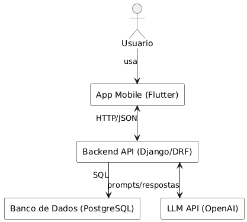
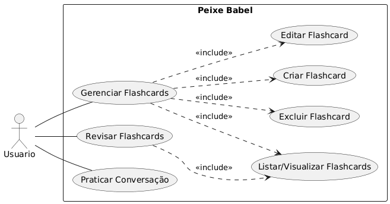
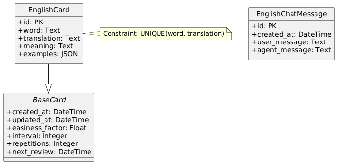
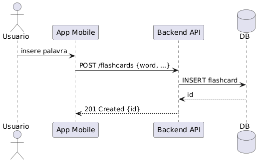
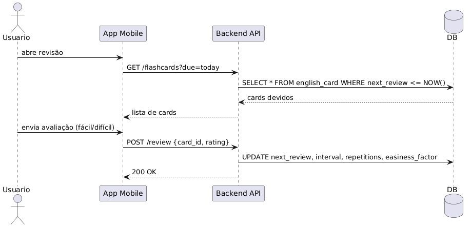
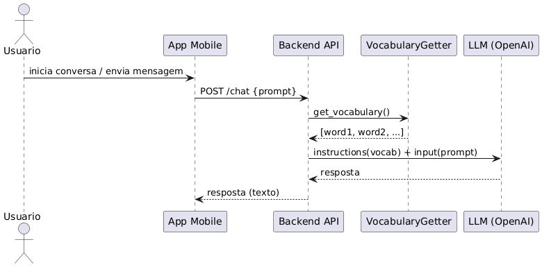
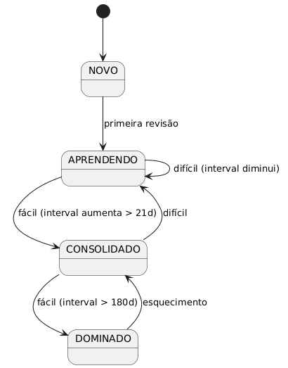
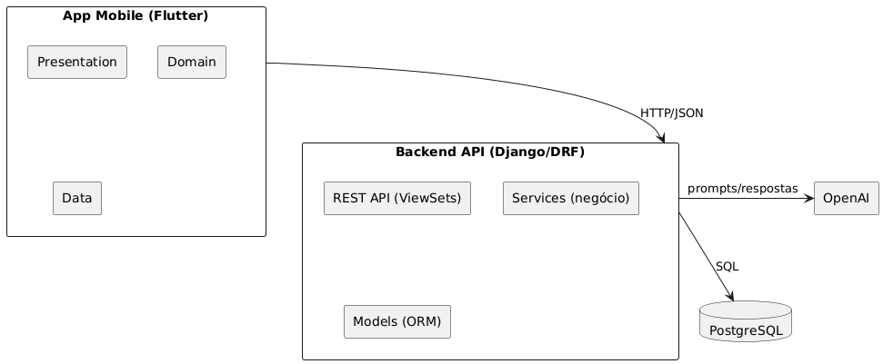

# Referências e Anexos Técnicos

## Referências Bibliográficas

### Aprendizado de Idiomas e SRS

1. **EBBINGHAUS, H.** Memory: a contribution to experimental psychology. New York: Teachers College, Columbia University, 1913.

2. **WOZNIAK, P. A.; GORZELAŃCZYK, E. J.** Optimization of repetition spacing in the practice of learning. Acta Neurobiologiae Experimentalis, v. 54, p. 59-62, 1994.

3. **KARPICKE, J. D.; ROEDIGER, H. L.** The critical importance of retrieval for learning. Science, v. 319, n. 5865, p. 966-968, 2008.

4. **CEPEDA, N. J. et al.** Distributed practice in verbal recall tasks: a review and quantitative synthesis. Psychological Bulletin, v. 132, n. 3, p. 354-380, 2006.

5. **UCHIHARA, T.; SAITO, K.; KEUNG, Y. C.** Roles of repetition in second language oral fluency development. Language Learning, v. 69, n. 3, p. 652-688, 2019.

6. **PANE, J. F. et al.** Promoting grit, tenacity, and perseverance. Santa Monica: RAND Corporation, 2015.

7. **OECD.** Digital Education Outlook 2021: digital transformation in education. Paris: OECD Publishing, 2021.

8. **NATION, I. S. P.** Learning vocabulary in another language. Cambridge: Cambridge University Press, 2001.

### Processamento de Linguagem Natural e LLMs

9. **VASWANI, A. et al.** Attention is all you need. In: ADVANCES IN NEURAL INFORMATION PROCESSING SYSTEMS 30. [S.l.]: Curran Associates, 2017.

10. **BROWN, T. B. et al.** Language models are few-shot learners. In: ADVANCES IN NEURAL INFORMATION PROCESSING SYSTEMS 33. [S.l.]: Curran Associates, 2020.

11. **OPENAI.** GPT-4 Technical Report. 2024. Disponível em: <https://openai.com/research/gpt-4>. Acesso em: 30 out. 2025.

12. **WEI, J. et al.** Chain-of-thought prompting elicits reasoning in large language models. arXiv, 2022. Disponível em: <https://arxiv.org/abs/2201.11903>. Acesso em: 30 out. 2025.

### Engenharia de Software e Arquitetura

13. **MARTIN, R. C.** Clean architecture: a craftsman's guide to software structure and design. Boston: Prentice Hall, 2017.

14. **FOWLER, M.** Patterns of enterprise application architecture. Boston: Addison-Wesley, 2002.

### Documentação de APIs e Tecnologias

15. **DJANGO SOFTWARE FOUNDATION.** Django REST Framework documentation. 2024. Disponível em: <https://www.django-rest-framework.org/>. Acesso em: 30 out. 2025.

16. **GOOGLE.** Flutter documentation. 2024. Disponível em: <https://flutter.dev/docs>. Acesso em: 30 out. 2025.

17. **ALANKAN886.** SuperMemo2 (v. 3.0.1). GitHub repository, 2025. Disponível em: <https://github.com/alankan886/SuperMemo2>. Acesso em: 13 nov. 2025.

### Anexo A — Documento de Visão Completo
Ver arquivo: `docs/documento_de_visao.md`

### Anexo B — Diagrama de Contexto
Ver arquivo: `docs/diagrama_de_contexto.md`

### Anexo C — Especificação de API
Acessar API: `http://{HOST_DA_API}:8000/api/v1/`

### Anexo D — Código-Fonte
Repositório GitHub: `https://github.com/alexcyrillo/peixe-babel`

### Anexo E — Diagramas UML Detalhados

#### **E.1 — Diagrama de Contexto**



#### **E.2 — Diagrama de Casos de Uso**



#### **E.3 — Diagrama de Classes**



#### **E.4 — Diagramas de Sequência**

##### E.4.1 — Criação de Flashcard
  


##### E.4.2 — Revisão de Flashcard (SRS)
  


##### E.4.3 — Conversação com IA
  


#### **E.5 — Diagrama de Estados**



#### **E.6 — Diagrama de Componentes**




### Anexo F — Exemplos de Prompts para LLM

#### F.1 — Prompt de Conversa 

```text
Você é um robô que conversa em Inglês, que se adapta ao vocabulário do estudante. O vocabulário que o seu aluno sabe é: <LISTA_DE_PALAVRAS>Se não for possível responder apenas com o vocabulário do aluno, pode utilizar outras, porém disponibilize a tradução dessas novas palavras utilizadas
```
Notas:
- `<LISTA_DE_PALAVRAS>` é construída a partir das palavras (`word`) dos flashcards cadastrados.


#### F.2 — Prompts de Geração de Campos de Flashcard 

```text
Você ajuda estudantes brasileiros de inglês criando cartões de estudo. Entregue traduções e significados em português do Brasil. Quando gerar exemplos, mantenha as frases em inglês, inclua a tradução em português e garanta que são curtas e naturais. Retorne apenas JSON válido que siga o formato solicitado.
```

##### User Prompt

```text
Gere o conteúdo de um flashcard para a palavra em inglês informada.
Palavra: <WORD>
Retorne um JSON com as chaves:
- translation: tradução da palavra para português do Brasil (string).
- meaning: explicação breve do significado em português do Brasil (string).
- examples: lista com 2 a 3 objetos contendo:
    - sentence: frase curta em inglês usando a palavra.
    - translation: tradução da frase para português do Brasil.
Responda exclusivamente com o JSON solicitado, sem texto adicional.
```

#### F.3 — Referências de Código

- Conversa: função `get_chat_response()`.
- Vocabulário dinâmico: função `get_vocabulary()`.
- Geração de campos: função `english_fields_generator()`.

### Anexo G — Configurações e Variáveis de Ambiente

#### **G.1 — `.env.example` (Backend)**

```bash
COMPOSE_PROJECT_NAME=peixe-babel
POSTGRES_DB_NAME=peixe_babel_db
POSTGRES_USER=peixe_babel_user
POSTGRES_PASSWORD=troque-esta-senha
OPENAI_API_KEY=key-api-open-api
```

### Anexo H — Licença e Termos de Uso

**Licença**: MIT License (código aberto)

**Política de Privacidade**: Resumo
- Dados coletados: email, flashcards, histórico de revisões, sessões de conversação
- Uso: exclusivamente para funcionalidade do aplicativo
- Compartilhamento: apenas com APIs necessárias (anonimizado quando possível)
- Retenção: dados mantidos enquanto conta ativa; exclusão sob demanda
- Conformidade: LGPD (Brasil)

---

## Glossário

- **Flashcard**: Cartão de estudo com frente (palavra) e verso (definição, exemplos)
- **SRS (Spaced Repetition System)**: Sistema de repetição espaçada que otimiza intervalos de revisão
- **LLM (Large Language Model)**: Modelo de linguagem de grande escala (ex.: GPT-4)
- **TTS (Text-to-Speech)**: Síntese de voz a partir de texto
- **API (Application Programming Interface)**: Interface para integração entre sistemas
- **REST**: Estilo arquitetural para APIs web baseado em HTTP
- **JWT (JSON Web Token)**: Formato de token para autenticação stateless
- **Clean Architecture**: Padrão arquitetural que prioriza separação de responsabilidades
- **SM-2 (SuperMemo 2)**: Algoritmo clássico de repetição espaçada
